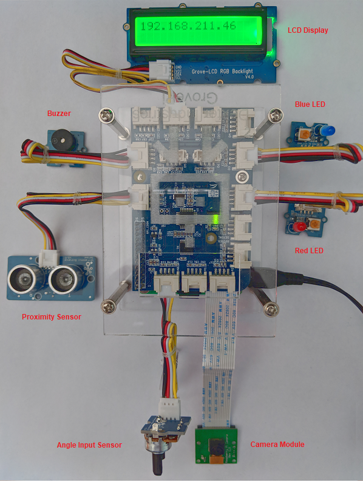

# IoT Core Workshop Virtual Device

The following provides a virtual IoT device for use with the AWS IoT Core Workshop. It is intended for use in the absense of physical hardare used by that workshop. Refer to the **[AWS IoT Core Workshop](https://github.com/joeireland/iot-core-workshop)** for details.

In order to build and launch the virtual IoT device, clone the repo and perform the following:

<pre>
cd iot-core-device-simulator
npm install
node index.js --port=80
</pre>

Once launched, use your web browser and open the virtual device at http://IP-ADDRESS-OF-MACHINE. When loaded, you will see a screen similar to the one shown below. The virtual device uses speakers of the system running the web browser to simulate the buzzer. Please ensure your volume is audible and not muted when testing.

